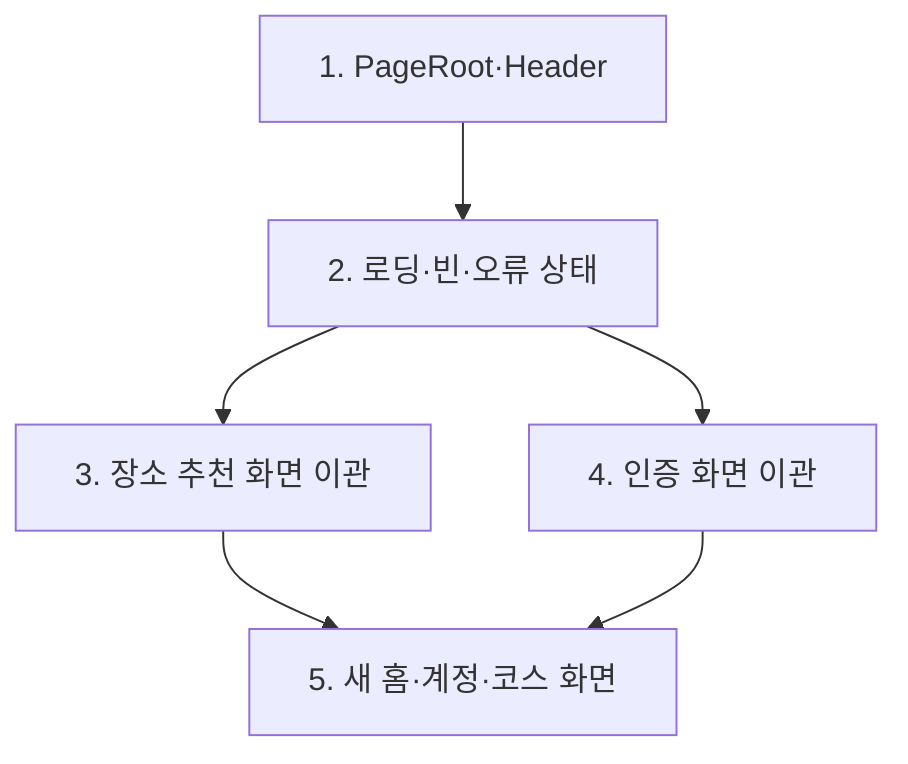

# UI 공통 기반과 전 화면 이관 로드맵

## 결론

궁극 목표는 모든 클라이언트 화면을 하나의 모바일 UI 기반으로 이관하는 것이다. 단, `chore/ui-foundations`에는 기반 계층만 넣고, 실제 화면 이관은 장소 추천과 인증을 분리해 진행한다. 이렇게 하면 공통 컴포넌트의 API를 먼저 안정화한 뒤 도메인별 화면을 병렬로 이관할 수 있다.

이 문서는 기존 [Figma-코드베이스 갭 계획](./26.08.10-figma-codebase-gap-plan.md)의 `chore/ui-foundations`를 실제 실행 단위로 세분화한 순서 문서다. Figma는 [프로젝트 메모리](../../../docs/work-memory.md)에 기록된 원칙에 따라 구현 기준점으로 사용하되, 기존에 검증된 동작과 제품 요구사항도 함께 보존한다.

## 현재 기준과 원칙

- 현재 디자인 토큰은 색상과 타이포그래피만 생성하며, 토큰 체계는 이번 작업에서 변경하지 않는다.
- `PageRoot`, `Modal`, `BottomSheet`, `OverlayShell`은 이미 존재하며, 실제 장소 추천·이력·회원가입 화면에서 사용 중이다. `Modal`과 `BottomSheet`의 public API와 상호작용은 이번 작업에서 변경하지 않는다.
- `Modal`과 `BottomSheet`의 `closed → opening → opened → closing` presence 모델은 [오버레이 재구성 문서](./26.06.29-overlay-components-reconstruction.md)의 결정을 유지한다.
- 공통 기반은 데이터 요청, 도메인 상태, 라우팅 정책을 소유하지 않는다. 화면이 `loading`·`empty`·`error` 상태와 필요한 액션을 전달한다.
- 기준 viewport는 390×844px이며, 안전 영역, 고정 CTA, 스크롤, overlay 높이를 해당 기준에서 검수한다.
- 각 작업 묶음은 독립적으로 typecheck·lint·390px 시각 검수를 통과한 뒤 다음 순서로 넘어간다. 현재 클라이언트에는 자동 UI 테스트 도구가 없으므로, 이관 단계와 함께 최소한의 컴포넌트 테스트 기반을 도입한다.

## 단계별 작업 순서

### 1. `PageRoot` 확장과 `Header` 추가

**목적:** 모든 화면이 공통 모바일 경계와 상단 바 규칙을 선택적으로 사용할 수 있게 한다. 이 단계가 `chore/ui-foundations`의 핵심이다.

**작업**

- 기존 `PageRoot`에 배경, 모바일 최대 폭, 안전 영역, 스크롤 영역, 고정 하단 영역을 선택적으로 제공하는 props와 스타일을 추가한다. 별도 `PageShell`은 만들지 않는다.
- `Header`를 추가한다. 제목, 선택적 뒤로가기, 오른쪽 액션을 props로 받고, 접근 가능한 버튼 이름과 터치 영역을 보장한다. 지도/전체화면처럼 상단 바가 없어야 하는 화면은 opt-out 한다.
- 배경 CSS 변수의 단일 소유 규칙은 `PageRoot`에 유지한다.
- `Modal`, `BottomSheet`, `OverlayShell`은 수정하지 않는다. 추천 폼의 날짜·위치 시트, 결과 목록 시트, 회원가입/이력 확인 modal은 현 동작이 유지되는지만 회귀 검수한다.

**완료 조건**

- 새 화면은 확장된 `PageRoot`와 `Header`를 선택적으로 조합할 수 있고, 기존 화면은 깨지지 않는다.
- 기존 modal/sheet 사용처가 열림·닫힘 애니메이션과 현재 backdrop 동작을 그대로 유지한다.

**다음 단계 진입 조건:** `PageRoot`와 `Header`의 API 및 시각 규칙이 확정되어 있어야 한다. 이 시점 이후 화면 이관 작업은 필요한 추가 요구를 공통 기반 작업으로 되돌려 제안한다.

### 2. 로딩·빈 결과·오류 상태 primitive

**목적:** 각 화면에 흩어진 문자열 placeholder와 제각각의 오류 표기를 동일한 구조로 바꾼다.

**작업**

- `LoadingState`, `EmptyState`, `ErrorState`를 추가한다. 제목, 설명, 선택적 아이콘, primary/secondary action을 props로 받는다.
- 네트워크 재시도, 뒤로가기, 입력 화면으로 돌아가기처럼 화면이 소유하는 행동은 action callback으로 전달한다.
- 추천 결과의 loading/error, protected/public route의 loading 표시처럼 이미 존재하는 placeholder를 우선 이관한다.
- API 오류 코드나 도메인별 메시지 매핑은 이 공통 계층에 넣지 않는다. 이는 각 도메인 화면 또는 API error presentation의 책임이다.

**완료 조건**

- loading, empty, error가 같은 여백·타이포·CTA 규칙을 가진다.
- 최소 한 개의 실제 추천 화면과 route 보호 상태가 primitive를 사용한다.
- 실패 상태에서 사용자가 가능한 다음 행동을 실행할 수 있다.

**다음 단계 진입 조건:** 상태 primitive와 shell을 함께 사용한 390px 캡처가 Figma의 공통 여백·고정 영역과 충돌하지 않아야 한다.

### 3. 장소 추천 화면 전면 이관

**목적:** 이미 기능이 있는 장소 추천 흐름을 새 기반으로 완전히 옮겨, 이후 코스 화면이 참조할 실사용 예시를 만든다.

**대상 순서**

1. 추천 입력 폼과 날짜·위치 선택 BottomSheet
2. 추천 진행 화면과 SSE 실패·재시도 상태
3. 결과 지도·목록·상세와 결과 없음/오류 상태
4. 추천 이력과 장소 즐겨찾기의 목록·빈 상태·확인 modal

**작업**

- 페이지별로 독자적인 header, padding, fixed CTA, loading/error/empty markup을 확장된 `PageRoot`, `Header`, 상태 primitive로 교체한다.
- 지도 surface와 지도 위 control은 전체화면/overlay 요구를 유지하며 `PageRoot`의 일반 콘텐츠 옵션에 억지로 맞추지 않는다.
- 기존 URL, React Query key, SSE 구독, form context, 즐겨찾기·이력 데이터 계약은 변경하지 않는다.
- Figma 상태별로 기본·선택·로딩·빈·오류·modal/bottom sheet를 390px에서 비교한다.

**완료 조건**

- 장소 추천의 모든 라우트가 새 기반을 사용한다.
- 기능 회귀 없이 입력 → 진행 → 결과 → 상세, 이력/즐겨찾기 진입, overlay 동작을 재현한다.
- 기존 화면별 스타일 정의에 남은 shell/header/state 중복이 제거된다.

### 4. 인증 화면 전면 이관

**목적:** 로그인, 회원가입, 비밀번호 재설정에 같은 화면 구조와 오류 상태를 적용한다.

**작업**

- 로그인, 회원가입, 이메일 인증, 비밀번호 재설정의 상단 바·콘텐츠·하단 CTA를 확장된 `PageRoot`와 `Header`로 이관한다.
- 인증 코드 오류/만료, 서버 실패, 완료 화면을 공통 상태 primitive와 도메인 메시지로 조합한다.
- 회원가입 완료 modal 등 기존 modal 흐름은 현재 overlay 동작을 그대로 유지하는지 확인한다.

**완료 조건**

- 인증 관련 모든 라우트가 새 기반을 사용한다.
- 잘못된 입력, 인증 코드 실패, 재전송, 성공 이동이 기존 API 계약을 유지한 채 동작한다.
- 390px에서 키보드 노출 시 CTA와 입력 영역이 가려지지 않는다.

### 5. 이후 신규 화면 적용과 잔여 이관

**목적:** 홈·계정·코스 화면은 처음부터 새 기반을 사용하고, 남은 예외 화면을 제거한다.

**작업**

- 향후 `home-account`, `course-*` 작업은 확장된 `PageRoot`, `Header`, 상태 primitive를 사용한다. 기존 `Modal`과 `BottomSheet`가 필요한 경우 현재 API를 그대로 사용한다.
- Health check, not-found, member placeholder처럼 현재 공통 기반 밖에 있는 라우트를 이관한다.
- 새 화면을 만들며 공통 API가 부족하면 화면에서 복제하지 않고, 기반 단계(1~2)의 명확한 확장 작업으로 되돌려 반영한다.

**완료 조건**

- 클라이언트의 모든 라우트가 공통 화면 기반을 사용하거나, 지도 전면 화면처럼 문서화된 예외다.
- 신규 화면이 별도 modal, sheet, header, loading/empty/error 스타일을 만들지 않는다.

## 검증과 병합 순서

| 작업 묶음              | 선행 조건 | 필수 검증                                             | 병합 뒤 허용되는 다음 작업 |
| ---------------------- | --------- | ----------------------------------------------------- | -------------------------- |
| 1. `PageRoot`·`Header` | 없음      | typecheck, lint, 기존 modal·sheet 수동 시나리오       | 2, 3, 4                    |
| 2. 상태 primitive      | 1         | typecheck, lint, loading/empty/error 390px 캡처       | 3, 4, 5                    |
| 3. 장소 추천 이관      | 1·2       | 장소 추천 전체 흐름, 지도·overlay 390px 캡처          | 5                          |
| 4. 인증 이관           | 1·2       | 로그인·가입·재설정 성공/실패 흐름, 모바일 키보드 검수 | 5                          |
| 5. 신규 화면·잔여 이관 | 1·2       | 라우트별 visual regression checklist, typecheck·lint  | 완료                       |

자동화는 기반 단계에서 다음을 최소로 추가한다.

- 공통 primitive의 렌더링·접근성·상태 전이를 검증할 클라이언트 테스트 환경
- 390px viewport의 주요 route와 overlay 상태를 캡처하는 browser 기반 시나리오
- 이후 도메인 브랜치가 Figma 프레임·route·상태를 함께 기록할 수 있는 회귀 체크리스트

## 범위 밖과 결정 사항

- API schema, 서버 route, recommendation engine, 데이터 저장 모델은 이 로드맵의 변경 대상이 아니다.
- `saved_places`와 `favorite_places`의 제품 의미, 코스 추천 엔진, 이력 복원 정책은 별도 도메인 작업에서 결정한다.
- 기존 화면의 모든 색상·여백 리터럴을 한 번에 치환하지 않는다. 해당 화면을 이관할 때 제거한다.
- Figma가 실제 구현 또는 제품 요구와 충돌하면, 충돌 사유와 채택한 동작을 프로젝트 메모리에 기록하고 필요 시 Figma 수정 범위를 별도로 제안한다.
