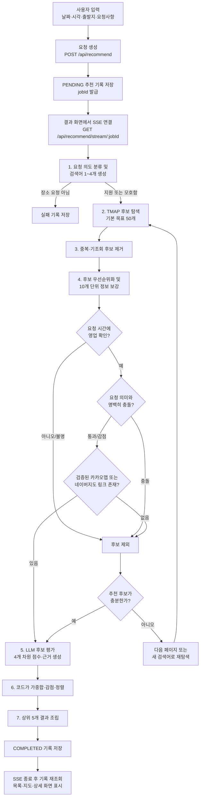

# 장소 추천 파이프라인 이해하기

> 기준: 2026-08-15 현재 작업 트리의 `recommendation-engine` v1과 이를 호출하는 서버·클라이언트

## 한 줄 요약

장소 추천은 **사용자 요청을 검색어로 바꾸고 → 실제 장소 후보를 넓게 찾고 → 영업 여부와 장소 정체성을 검증하고 → 요청 적합도를 점수화해 → 상위 5곳을 저장·표시하는 과정**이다.

중요한 점은 LLM이 처음부터 최종 장소 5곳을 지어내는 구조가 아니라는 것이다. 장소의 기본 목록은 TMAP에서 가져오고, 영업시간과 지도 링크를 외부 정보로 검증한 후보만 LLM 평가와 코드 기반 정렬을 거쳐 결과가 된다.

## 전체 흐름



## 1. 사용자가 입력하는 정보

필수 입력은 다음 네 가지다.

- 날짜
- 시각
- 출발지 1곳 이상
- 자연어 요청사항

선택 입력으로 체류 시간, 활동 유형, 인원, 관계 유형, 1인당 예산을 받을 수 있다. 출발지는 최대 8곳까지 UI에서 추가할 수 있다.

엔진에 전달되는 형태를 단순화하면 다음과 같다.

```ts
{
  schedule: {
    dateISO: "2026-08-20",
    time24h: "19:00",
    stayDurationMinutes: 120
  },
  location: [
    { lat: 37.498, lng: 127.027 },
    { lat: 37.556, lng: 126.923 }
  ],
  numberOfPeople: 4,
  partyType: "FRIENDS",
  activityType: "MEAL",
  budgetPerPerson: [20000, 40000],
  userNaturalLanguageRequest: "중간 지점에서 대화하기 좋은 파스타 식당"
}
```

여러 출발지가 있으면 탐색과 대표 접근성 계산에는 모든 좌표의 중심점을 사용한다. 최종 결과에는 중심점 거리뿐 아니라 각 출발지에서 후보까지의 직선거리도 별도로 담는다.

## 2. 요청 접수와 실행 시작

클라이언트가 `POST /api/recommend`를 호출하면 서버는 즉시 추천을 계산하지 않는다. 먼저 다음 작업을 한다.

1. 로그인 사용자와 입력 스키마를 검증한다.
2. 화면에 표시된 출발지 좌표와 엔진 입력 좌표가 같은지 확인한다.
3. DB의 `place_recommendation_histories`에 입력을 저장하고, 결과와 오류는 비워 둔다. 이 상태를 조회할 때 `PENDING`으로 해석한다.
4. UUID 형식의 `jobId`를 반환한다.

클라이언트는 이 ID의 결과 화면으로 이동한다. 결과가 아직 `PENDING`이면 `GET /api/recommend/stream/:jobId`로 SSE 연결을 열고, 이때 서버가 추천 엔진을 한 번만 시작한다.

진행 단계는 아래 순서로 전달된다.

| 공개 단계 | 화면 의미 | 실제 처리 |
| --- | --- | --- |
| `input_validated` | 입력 검증 완료 | 초기 의도 분류·검색 계획 시작 |
| `discovering` | 장소 후보 탐색 중 | TMAP 후보 검색 |
| `evaluating` | 장소 후보 평가 중 | 후보 evidence 구성 |
| `enriching` | 장소 정보 수집 중 | 영업시간·신뢰 정보·지도 링크 검증 |
| `scoring` | AI 점수 계산 중 | 후보별 4개 차원 평가 |

SSE 연결이 끊겨도 이미 시작한 엔진 작업은 계속된다. 클라이언트는 5초 간격의 기록 조회를 복구 경로로도 사용하며, 완료 후 DB에 저장된 결과를 다시 읽어 화면을 그린다.

## 3. 요청 의도 분류와 검색 계획

첫 LLM 호출은 두 일을 한 번에 한다.

1. 요청이 장소 추천인지 분류한다.
2. 장소 검색에 사용할 짧은 TMAP 검색어를 만든다.

분류 결과는 세 가지다.

- `SUPPORTED`: 명확한 장소 추천 요청
- `AMBIGUOUS`: 희소하거나 복합적이지만 장소 추천으로 해석 가능한 요청
- `UNSUPPORTED`: 장소 추천으로 처리할 수 없는 요청

`UNSUPPORTED`는 의미 없는 입력, 장소와 무관한 요청, 서로 모순되는 요청에만 제한적으로 사용한다. 애매한 장소 요청은 거절하지 않고 `AMBIGUOUS`로 탐색을 계속한다.

검색어는 1~4개의 짧은 업종·장소 유형으로 만든다. 예를 들어 “대화하기 좋은 파스타 식당”은 `파스타`, `이탈리안 레스토랑`, `양식 레스토랑`처럼 검색 가능한 표현으로 바뀐다. 좁은 요청에는 결과가 0개가 되는 일을 줄이기 위해 넓은 업종 검색어를 하나 섞는다. 비건·할랄처럼 핵심 식이 조건은 넓은 검색어로 바꿀 때도 보존한다.

검색 개수는 LLM이 정하지 않는다. 코드가 목표 후보 수를 검색어별로 고르게 나눠 TMAP의 페이지당 최대 20개 제한을 지킨다.

## 4. 장소 후보 탐색: `discoverSeeds`

현재 실제 후보 공급자는 TMAP이다. 각 검색어를 출발지 중심 반경 5km와 함께 병렬 호출하고, 응답을 공통 `LocalSeed` 형태로 바꾼다.

한 seed에는 대략 다음 정보가 있다.

- TMAP 장소 ID
- 상호명과 카테고리
- 전화번호
- 지번·도로명 주소
- 위도·경도

기본 설정은 최종 5곳의 10배인 **최대 50개 후보 풀**을 목표로 한다.

검색 후에는 공급자 장소 ID를 우선 키로 사용해 중복을 제거한다. ID가 없을 때만 상호명, 주소, 좌표를 조합한 키를 쓴다. 이전 시도에서 이미 확인했거나 탈락한 키도 제외한다.

검색어 하나가 실패해도 다른 검색어의 성공 결과는 살린다. 모든 검색어가 실패했을 때만 공급자 장애로 처리한다. 다음 페이지가 있으면 `nextQueries`로 보관해 이후 재탐색에 사용한다.

## 5. 후보 검증과 정보 보강: `evaluateSeeds`

TMAP seed만으로는 “요청한 시간에 실제로 여는지”, “지도 링크가 정확히 같은 지점인지”, “비건·예산 같은 조건에 맞는지”를 충분히 알 수 없다. 그래서 seed를 공통 evidence 형태로 바꾼 뒤 비싼 검증을 수행한다.

### 5.1 가벼운 우선순위 정렬

모든 후보를 즉시 웹 검증하지 않고, 먼저 다음 신호로 처리 순서를 정한다.

- 요청의 카페·식사·술자리 의도와 카테고리 일치
- 중심점과의 거리
- 주소 존재 여부
- 기존 근거 URL 존재 여부

이 순서는 최종 순위가 아니다. 비용이 큰 검증을 어떤 후보부터 할지 정하는 사전 순서다.

### 5.2 10개 단위 정보 보강

후보는 10개씩 처리한다. 기본 설정에서는 최종 5곳의 두 배인 최대 10개가 검증을 통과하면 점수화 풀을 채운 것으로 본다. 부족하면 다음 10개를 이어서 확인하며, 전체 평가 한도는 기본 50개다.

정보 보강 에이전트는 후보별로 다음 도구를 선택적으로 사용한다.

- Kakao Local: 실제 장소 존재, 좌표·상호 일치, 카카오맵 URL
- Naver Search: 영업시간 스니펫, 외부 언급과 리뷰 신호
- 일반 웹 검색 및 본문 fetch: 영업시간·가격 등 원문 근거
- Naver Map 스크래핑: 다른 출처로 영업시간을 확인하지 못했을 때의 마지막 수단

한 추천 실행에서는 브라우저 하나를 공유하고, 스크래핑 결과는 로컬 캐시를 사용한다. 후보별 보강 실패는 전체 실행을 바로 실패시키지 않고 그 후보를 `UNKNOWN`으로 낮춘다.

## 6. 통과해야 하는 세 개의 문

최종 점수 계산 전에 후보는 세 가지 품질 조건을 차례로 통과해야 한다.

### 문 1: 요청 시간에 실제로 영업하는가

영업시간은 단순히 “현재 영업 중” 문구만 보는 것이 아니다. 요청 날짜의 요일, 도착 시각, 체류 시간, 브레이크 타임, 라스트 오더를 함께 확인한다.

- 전체 체류 시간이 영업시간 안에 있어야 한다.
- 브레이크 타임과 겹치면 탈락한다.
- 도착이 라스트 오더 뒤면 탈락한다.
- 체류 시간을 입력하지 않았으면 요청 시각을 확인하기 위한 1분 구간을 사용한다.
- 영업정보가 `UNKNOWN`이면 안전하게 탈락한다. `UNKNOWN`을 임의로 `OPEN`으로 바꾸지 않는다.

즉, 이 단계에서는 **확인된 `OPEN` 후보만** 남는다.

### 문 2: 사용자의 명시 조건과 정면으로 충돌하지 않는가

규칙 기반 semantic gate가 상호명·카테고리·주소·검증된 가격·식이 근거를 본다.

- `REJECT`: 파스타 요청에 명백한 햄버거집, 비건 요청에 확인된 육류 중심 장소, 단일 지역 요청과 명백히 다른 지역처럼 강한 충돌은 즉시 제외
- `PENALIZE`: 일반적인 업종 차이처럼 확정 탈락까지는 아닌 경우는 남기되 최종 점수 감점 및 상한 적용
- `PASS`: 뚜렷한 충돌이 없으면 통과

정보가 없다는 이유만으로 희소 조건을 무조건 거절하지는 않는다. 명백한 양성 충돌일 때만 hard reject하고, 불확실한 경우는 통과 또는 감점으로 다룬다.

### 문 3: 사용자를 정확한 지도 장소로 보낼 수 있는가

최종 결과에는 검증된 카카오맵 또는 네이버지도 URL이 최소 하나 있어야 한다. 후보명만 같은 다른 지점으로 연결되는 것을 막기 위해 이름, 주소, 좌표 거리 등을 조합해 장소 identity를 확인한다.

특히 주소·좌표 근거가 약한 네이버 검색 링크 하나만 있는 경우는 공개 링크로 쓰지 않는다. 강한 카카오 장소 근거가 있거나 지도 entity 일치도가 충분해야 통과한다.

이 세 문은 점수가 높아도 우회할 수 없는 안전장치다.

## 7. LLM 점수화와 코드 기반 정렬

검증을 통과한 후보만 LLM 평가로 넘어간다. 후보는 최대 8개씩 묶어 평가한다. 여러 후보를 같이 보여 주는 이유는 `diversity`가 후보끼리 비교해야 의미가 있기 때문이다.

LLM은 후보마다 다음 네 점수와 설명 근거를 만든다.

| 점수 | 의미 |
| --- | --- |
| `inputMatch` | 자연어 요청, 활동, 인원, 관계, 예산과의 일치도 |
| `trust` | 검증 출처, 장소 일치도, 리뷰·외부 언급 등 신뢰도 |
| `accessibility` | 거리, 이동 편의, 영업시간 적합성 |
| `diversity` | 다른 후보와 겹치지 않는 경험·카테고리 다양성 |

LLM은 최종 총점을 직접 결정하지 않는다. 기본 설정에서는 코드가 네 점수를 같은 비중으로 가중 평균한다.

```txt
기본 총점 =
  inputMatch × 0.25
  + trust × 0.25
  + accessibility × 0.25
  + diversity × 0.25
```

그다음 semantic gate의 감점과 점수 상한을 코드가 적용한다. 최종 정렬도 결정론적이다.

1. 총점 내림차순
2. 동점이면 `inputMatch` 내림차순
3. 다시 동점이면 `trust` 내림차순
4. 다시 동점이면 `accessibility` 내림차순

LLM 응답에서 후보 ID가 누락되거나 중복·예상 밖 ID가 나오면 해당 항목을 버린다. 묶음 평가가 실패하면 후보별로 다시 시도하고, 그래도 실패한 후보만 제외한다.

## 8. 최종 결과 만들기

정렬된 상위 5개를 `PlaceRecommendationItem`으로 변환한다. 각 결과에는 다음 정보가 들어간다.

- 장소 ID, 상호명, 전화번호
- 주·보조 카테고리와 태그
- 사용자용 콘텐츠 요약
- 주간 영업시간과 요청 시각 영업 판정
- 검증된 카카오맵·네이버지도·기타 근거 URL
- 대표 접근성 점수와 출발지별 직선거리
- 1인당 예상 가격대
- 0~100 추천 점수와 4개 차원 점수
- 추천 이유 1~3개

가격 원문을 확인했다면 그 범위를 우선 사용한다. 가격 근거가 없을 때는 사용자의 예산을 그대로 복사하지 않고 카테고리별 기본 범위를 사용한다.

주소도 검증되지 않은 숫자를 도로명 뒤에 임의로 붙이지 않는다. 완전한 도로명 주소가 없으면 공급자의 지번 주소를 안전한 대안으로 사용한다.

## 9. 후보가 부족할 때의 재탐색

엔진은 최대 5번 discovery 시도를 한다. retry 계약이 표현할 수 있는 부족 사유는 다음과 같다.

- 후보가 0개임: `ZERO_SEEDS`
- 검증 후 품질 좋은 후보가 부족함: `LOW_QUALITY`
- 요청 시간에 여는 후보가 부족함: `TOO_FEW_OPEN_NOW`
- 요청 의미와 맞지 않는 후보가 많음: `LOW_APPROACH_MATCH`
- 중복이 많음: `DUPLICATE_HEAVY`
- 지도 URL 검증 탈락이 많음: `REFERENCE_URL_REJECTED_HEAVY`

현재 주 실행 경로에서 직접 만들어 쓰는 값은 `ZERO_SEEDS`, `LOW_QUALITY`, `TOO_FEW_OPEN_NOW`, `REFERENCE_URL_REJECTED_HEAVY`다. 나머지 두 값은 계약에는 준비되어 있지만 현재 평가 구현이 직접 반환하지는 않는다.

먼저 같은 검색어의 다음 페이지를 사용한다. 페이지가 끝났으면 실패 이유를 LLM에 전달해 다른 각도의 검색어를 만든다. 이미 본 후보와 탈락 후보는 누적 제외해 같은 장소를 반복 평가하지 않는다.

5번을 모두 써도 추천 가능한 후보를 만들지 못하면 `EVALUATE_SEEDS_NO_RECOMMENDABLE_CANDIDATES`로 종료한다. 지도·영업·의미 검증을 완화해서 억지로 5곳을 채우지는 않는다.

## 10. 저장, 전달, 복구

성공 시 서버는 결과를 DB에 먼저 저장한 뒤 SSE `result` 이벤트를 보낸다. 실패 시에도 내부 오류 코드를 DB에 저장하고, 사용자에게는 비밀값이나 내부 오류가 노출되지 않는 한국어 메시지를 보낸다.

기록 상태는 별도 status 컬럼이 아니라 저장된 값으로 계산한다.

- `output`이 있으면 `COMPLETED`
- `errorCode` 또는 `errorMessage`가 있으면 `FAILED`
- 둘 다 없으면 `PENDING`

각 실행은 설정된 로그 디렉터리에 세 종류의 진단 파일도 남긴다.

- `*.input.json`: 입력
- `*.log.jsonl`: 단계별 엔진 이벤트
- `*.result.json`: 최종 결과 또는 thrown error

로깅 실패가 추천 결과 자체를 실패시키지는 않는다.

## 11. 기본 숫자 한눈에 보기

| 항목 | 현재 기본값 |
| --- | ---: |
| 최종 추천 목표 | 5곳 |
| 최초 후보 목표 | 최대 50곳 (`5 × 10`) |
| 검색어 수 | 1~4개 |
| 검색 반경 | 출발지 중심 5km |
| TMAP 검색어당 페이지 최대 개수 | 20개 |
| enrichment 배치 | 10곳 |
| LLM 점수화 대상 풀 | 기본 최대 10곳 |
| 한 번의 LLM 점수화 묶음 | 최대 8곳 |
| discovery 최대 시도 | 5회 |
| LLM 모델 | `gpt-5.4-nano` |
| 실행 내 LLM 동시성 | 1 |
| LLM 기본 재시도 | 2회 |

## 12. 외부 시스템의 역할

| 시스템 | 역할 |
| --- | --- |
| OpenAI | 요청 의도 분류, 검색어 생성·재생성, 후보 정보 보강 제어, 영업시간 파싱 보조, 후보별 점수·근거 생성 |
| TMAP | 최초 실제 장소 후보 목록 제공 |
| Kakao Local/Map | 장소 존재·좌표·상호 identity와 카카오맵 URL 확인 |
| Naver Search | 영업시간 스니펫, 외부 언급·리뷰·가격 근거 수집 |
| Naver Map | 다른 출처가 부족할 때 영업정보와 지도 identity 보강 |
| PostgreSQL | 요청 입력, 완료 결과, 실패 상태, 사용자 기록 보존 |
| SSE | 진행 단계와 완료·실패 이벤트 전달 |

필요한 서버 환경변수는 `OPENAI_API_KEY`, `TMAP_APP_KEY`, `KAKAO_REST_API_KEY`, `NAVER_SEARCH_CLIENT_ID`, `NAVER_SEARCH_CLIENT_SECRET`이다.

## 13. 예시로 따라가기

입력이 다음과 같다고 가정한다.

> 8월 20일 19시, 강남역과 홍대입구역에서 출발, 친구 4명, 1인 2만~4만 원, “중간 지점에서 대화하기 좋은 파스타 식당”

파이프라인은 대략 이렇게 움직인다.

1. 두 출발지의 중심점을 계산한다.
2. 요청을 장소 추천으로 분류하고 `파스타`, `이탈리안 레스토랑`, `양식 레스토랑` 같은 검색어를 만든다.
3. 중심 반경 5km에서 TMAP 후보를 모아 중복을 제거한다.
4. 가까우면서 파스타·식사 카테고리에 맞는 후보부터 10개씩 확인한다.
5. 19시부터 체류 시간 전체에 영업하지 않는 곳, 브레이크 타임인 곳, 영업정보가 불명인 곳을 제외한다.
6. 파스타 요청과 명백히 충돌하는 패스트푸드 등은 제외한다.
7. 상호·주소·좌표가 맞는 지도 링크를 확보하지 못한 후보를 제외한다.
8. 남은 후보의 요청 일치도, 신뢰도, 접근성, 다양성을 평가한다. “대화하기 좋다”는 후보별 근거가 없으면 사실처럼 단정하지 않고 일치도를 낮춘다.
9. 코드가 점수를 합산해 상위 5곳을 정렬하고 추천 이유와 출발지별 거리를 붙인다.
10. 결과를 DB에 저장한 뒤 클라이언트가 목록·지도·상세 화면에 표시한다.

## 14. 코드를 찾을 때의 지도

| 관심사 | 주요 파일 |
| --- | --- |
| 전체 retry와 단계 조율 | `packages/recommendation-engine/src/v1/engine.ts` |
| 입력·출력 계약 | `packages/recommendation-engine/src/v1/interfaces/input.contracts.ts`, `output.contracts.ts` |
| 의도 분류와 검색어 생성 | `packages/recommendation-engine/src/v1/steps/discoverSeeds/llm/approaches.ts` |
| TMAP 후보 탐색 | `packages/recommendation-engine/src/v1/steps/discoverSeeds/index.ts`, `vendors/tmap-local.ts` |
| 후보 평가 전체 흐름 | `packages/recommendation-engine/src/v1/steps/evaluateSeeds/index.ts` |
| 배치·영업·semantic·URL gate | `evaluateSeeds/utils/enrichment-batches.ts`, `operation-hours.ts`, `semantic-fit.ts`, `tools/reference-urls.ts` |
| LLM 점수화 | `packages/recommendation-engine/src/v1/steps/evaluateSeeds/llm/scoring.ts` |
| 가중합과 정렬 | `packages/recommendation-engine/src/v1/steps/evaluateSeeds/utils/ranking.ts` |
| 사용자 결과 조립 | `packages/recommendation-engine/src/v1/steps/evaluateSeeds/utils/output.ts` |
| 서버 job·SSE·DB 저장 | `apps/server/src/recommendation/router.ts` |
| 추천 기록 조회 | `apps/server/src/routes/placeRecommendationHistories.ts` |
| 클라이언트 요청 생성 | `apps/client/src/pages/PlaceRecommendationForm/input.ts` |
| 진행 상태 수신 | `apps/client/src/features/PlaceRecommendationResult/components/PlaceRecommendationResultPending.tsx` |

## 15. 이 구조를 이해할 때 주의할 점

- 점수는 검증을 대신하지 않는다. `OPEN`, 의미 적합성, 지도 identity는 점수화 이전의 gate다.
- 최종 5곳보다 정확성이 우선이다. 조건을 통과하지 못하면 재탐색하거나 실패한다.
- `accessibility`는 현재 실시간 경로 이동시간이 아니라 공급자 거리 또는 직선거리 중심의 신호다. 결과의 `perOrigin` 역시 직선거리다.
- “조용함”, “분위기 좋음” 같은 주관적 특성은 후보별 외부 근거가 없으면 확정 사실로 말하지 않도록 점수화 프롬프트가 제한한다.
- 공급자·LLM·스크래핑을 함께 쓰므로 실행 시간이 길 수 있다. 그래서 UI는 SSE 진행 단계, DB 기록, polling 복구 경로를 함께 사용한다.
- 이 문서는 현재 v1 구현 설명이다. 설정값이나 provider가 바뀌면 특히 기본 숫자, gate, 외부 시스템 표를 함께 갱신해야 한다.
